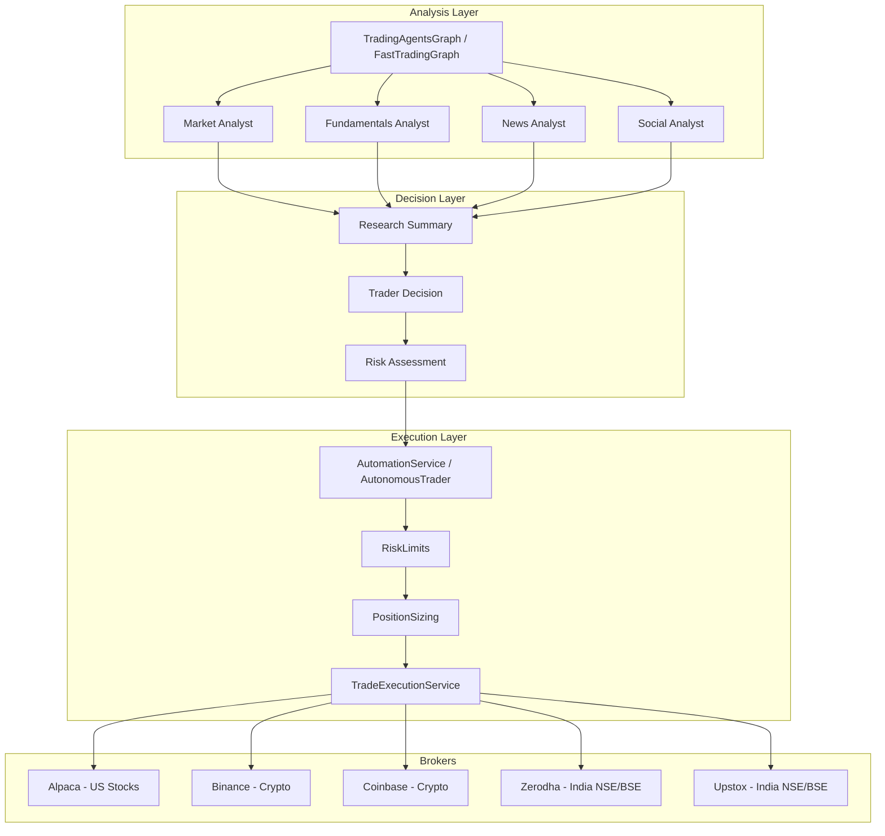

# TradingAgents System Reference & Improvement Roadmap

> **Purpose**: This document explains how automatic trading works and outlines improvements for stability, speed, profitability with medium portfolio risk.

---

## Table of Contents

1. [Current Architecture](#current-architecture)
2. [How Automatic Buy/Sell Works](#how-automatic-buysell-works)
3. [Broker Integrations](#broker-integrations)
4. [Risk Management System](#risk-management-system)
5. [Stability Improvements](#stability-improvements)
6. [Speed Improvements](#speed-improvements)
7. [Profitability Improvements](#profitability-improvements)
8. [Recommended Configuration](#recommended-configuration)

---

## Current Architecture



---

## How Automatic Buy/Sell Works

### Trading Flow

| Step | Component | Description |
|------|-----------|-------------|
| 1 | **Analysis** | `TradingAgentsGraph` or `FastTradingGraph` analyzes the stock |
| 2 | **Decision** | LLM produces BUY/HOLD/SELL decision with confidence |
| 3 | **Parsing** | `TradeExecutionService.parse_decision()` extracts action |
| 4 | **Risk Check** | `RiskLimits.can_trade()` validates against limits |
| 5 | **Position Sizing** | `PositionSizingCalculator` determines quantity |
| 6 | **Execution** | `execute_trade()` sends order to broker |
| 7 | **Tracking** | Trade is logged and positions updated |

### Key Files

| File | Purpose |
|------|---------|
| [execution_service.py](file:///Users/vigneshnagarajan/personal/TradingAgents/tradingagents/services/execution_service.py) | Broker connection, order execution |
| [automation_service.py](file:///Users/vigneshnagarajan/personal/TradingAgents/tradingagents/services/automation_service.py) | Continuous monitoring with watchlist |
| [autonomous_trader.py](file:///Users/vigneshnagarajan/personal/TradingAgents/tradingagents/services/autonomous_trader.py) | Auto-discovers stocks from news |
| [position_sizing.py](file:///Users/vigneshnagarajan/personal/TradingAgents/tradingagents/services/position_sizing.py) | Calculate trade quantity |
| [risk_limits.py](file:///Users/vigneshnagarajan/personal/TradingAgents/tradingagents/services/risk_limits.py) | Safety controls |

### Paper vs Live Trading

```python
# Paper trading (SAFE - simulated)
execution_service = TradeExecutionService(
    paper_trading=True,
    live_trading_approved=False
)

# Live trading (REAL money)
execution_service = TradeExecutionService(
    paper_trading=False,
    live_trading_approved=True,  # Explicit approval required!
    broker_configs={
        "alpaca": {"api_key": "...", "secret_key": "..."}
    }
)
```

> [!CAUTION]
> Live trading is **disabled by default**. You must explicitly set `live_trading_approved=True`.

---

## Broker Integrations

| Broker | Markets | Status | Paper Trading |
|--------|---------|--------|---------------|
| **Alpaca** | US NYSE/NASDAQ | ✅ Integrated | ✅ Built-in |
| **Binance** | Crypto | ✅ Integrated | ✅ Testnet |
| **Coinbase** | Crypto | ✅ Integrated | ✅ Sandbox |
| **Zerodha** | India NSE/BSE | ✅ Integrated | ⚠️ Manual |
| **Upstox** | India NSE/BSE | ✅ Integrated | ⚠️ Manual |

---

## Risk Management System

### Current Risk Controls

| Control | Default | Description |
|---------|---------|-------------|
| `max_position_size` | 10% | Max single position as % of portfolio |
| `max_daily_trades` | 10 | Max trades per day |
| `max_daily_loss` | 5% | Stop trading if daily loss exceeds |
| `max_portfolio_risk` | 20% | Max portfolio at risk |
| `max_concentration` | 30% | Max exposure to single market |
| `min_balance_required` | 10% | Keep as reserve |

### Position Sizing Methods

| Method | Description | Best For |
|--------|-------------|----------|
| `FIXED` | Fixed dollar amount | Beginners |
| `PERCENTAGE` | % of portfolio | Standard use |
| `RISK_BASED` | Based on stop-loss distance | Advanced |
| `KELLY` | Kelly Criterion optimized | Proven strategies |

---

## Stability Improvements

### High Priority

| # | Improvement | Impact | Effort |
|---|-------------|--------|--------|
| 1 | **Add circuit breakers** | Stop trading on unusual market conditions | Medium |
| 2 | **Retry with backoff** | Handle temporary API failures | Low |
| 3 | **Health monitoring** | Auto-restart on failures | Medium |
| 4 | **Database persistence** | Don't lose state on restart | High |

### Implementation Suggestions

#### 1. Circuit Breakers
```python
# Add to risk_limits.py
def check_market_conditions(self, symbol: str) -> bool:
    """Halt trading if market is abnormal"""
    # Check VIX > 40 (extreme volatility)
    # Check if stock moved > 10% in 1 hour
    # Check if bid-ask spread > 1%
    pass
```

#### 2. Database Persistence
```python
# Store positions, trades, and state in SQLite/PostgreSQL
# Recover on restart
```

---

## Speed Improvements

### Already Implemented ✅

| Improvement | Status | Speedup |
|-------------|--------|---------|
| Parallel analyst execution | ✅ Done | 3-4x |
| Pre-fetch data | ✅ Done | 2x |
| Single-pass analysis | ✅ Done | 50% fewer LLM calls |

### Remaining Optimizations

| # | Improvement | Expected Speedup | Effort |
|---|-------------|------------------|--------|
| 1 | **Cache LLM responses** | 2-5x for repeated analyses | Low |
| 2 | **Batch multiple symbols** | 2x for watchlist analysis | Medium |
| 3 | **Use faster models** | 2-3x (GPT-4o-mini vs GPT-4) | Config only |
| 4 | **Pre-market analysis** | Decisions ready at market open | Medium |

### Recommended Model Configuration

```python
config = {
    "llm_provider": "openrouter",  # Best value
    "quick_think_llm": "deepseek/deepseek-chat",  # Fast + cheap
    "deep_think_llm": "deepseek/deepseek-r1",  # For complex decisions
    "execution_mode": "fast",  # Use parallel execution
}
```

---

## Profitability Improvements

### Strategy Enhancements

| # | Improvement | Expected Impact | Risk Level |
|---|-------------|-----------------|------------|
| 1 | **Add stop-loss/take-profit** | Protect gains, limit losses | Low |
| 2 | **Trailing stop-loss** | Lock in profits on winners | Low |
| 3 | **Multiple timeframe analysis** | Better entry/exit timing | Medium |
| 4 | **Sector rotation** | Rotate to strong sectors | Medium |
| 5 | **Momentum filters** | Trade with the trend | Low |
| 6 | **Volatility-adjusted sizing** | Smaller positions in volatile markets | Medium |

### Recommended Additions

#### 1. Stop-Loss / Take-Profit

Add to `execution_service.py`:

```python
def execute_trade_with_brackets(
    self, symbol, action, quantity,
    stop_loss_pct=0.02,    # 2% stop loss
    take_profit_pct=0.05   # 5% take profit
):
    """Execute trade with automatic bracket orders"""
    # Place main order
    result = self.execute_trade(symbol, action, quantity)
    
    if result["status"] == "success":
        entry_price = result["fill_price"]
        
        # Place stop-loss
        stop_price = entry_price * (1 - stop_loss_pct if action == "BUY" else 1 + stop_loss_pct)
        self._place_stop_order(symbol, "SELL" if action == "BUY" else "BUY", quantity, stop_price)
        
        # Place take-profit
        target_price = entry_price * (1 + take_profit_pct if action == "BUY" else 1 - take_profit_pct)
        self._place_limit_order(symbol, "SELL" if action == "BUY" else "BUY", quantity, target_price)
    
    return result
```

#### 2. Trailing Stop-Loss

```python
class TrailingStopManager:
    """Monitor positions and adjust stop-loss upward"""
    
    def update_stops(self, positions: Dict, current_prices: Dict):
        for symbol, pos in positions.items():
            current = current_prices[symbol]
            entry = pos["entry_price"]
            
            # If up 3%+, trail stop 2% below high
            if current > entry * 1.03:
                new_stop = max(pos.get("stop_price", 0), current * 0.98)
                pos["stop_price"] = new_stop
```

#### 3. Momentum Filter

Only trade stocks with positive momentum:

```python
def has_momentum(self, ticker: str) -> bool:
    """Check if stock has positive momentum"""
    # RSI between 50-70 (bullish but not overbought)
    # Price above 20-day SMA
    # Volume above average
    pass
```

---

## Recommended Configuration for Medium Risk

### Portfolio Settings

```python
MEDIUM_RISK_CONFIG = {
    # Position Sizing (Conservative)
    "position_sizing": {
        "method": "percentage",
        "percentage": 0.02,        # 2% per trade
        "max_position_size": 0.05, # 5% max per position
    },
    
    # Risk Limits (Medium)
    "risk_limits": {
        "max_position_size": 0.05,   # 5% max per position
        "max_daily_trades": 5,       # Limit overtrading
        "max_daily_loss": 0.03,      # 3% daily loss limit
        "max_portfolio_risk": 0.10,  # 10% portfolio at risk
        "max_concentration": 0.20,   # 20% max per market
        "min_balance_required": 0.20 # Keep 20% cash
    },
    
    # Trading Settings
    "trading": {
        "min_confidence": 0.70,      # Only high-confidence trades
        "use_stop_loss": True,
        "stop_loss_pct": 0.02,       # 2% stop loss
        "take_profit_pct": 0.04,     # 4% take profit (2:1 risk/reward)
        "trailing_stop": True,
        "trailing_stop_pct": 0.02,
    },
    
    # Execution
    "execution_mode": "fast",
    "paper_trading": True,  # Start with paper trading!
}
```

### Risk/Reward Targets

| Metric | Target | Rationale |
|--------|--------|-----------|
| Win Rate | > 55% | Sustainable with medium risk |
| Risk/Reward | 1:2 | 2% risk for 4% potential gain |
| Max Drawdown | < 15% | Stop trading if exceeded |
| Max Positions | 5 | Diversification |
| Daily Trades | 3-5 | Quality over quantity |

---

## Implementation Priority

### Phase 1: Foundation ✅ COMPLETE
- [x] Add stop-loss/take-profit orders (`bracket_orders.py`)
- [x] Implement trailing stops (`BracketOrderManager`)
- [x] Add database persistence (`trading_database.py`)
- [x] Set up health monitoring (`health_monitor.py` enhanced)

### Phase 2: Optimization (Week 3-4) ✅ COMPLETE
- [x] Add LLM response caching (`llm_cache.py`)
- [x] Implement batch symbol analysis (`AutomationService`)
- [x] Add momentum filters (`market_filter.py`)
- [x] Pre-market analysis system (`morning_brief.py`)

### Phase 3: Advanced (Week 5-8) ✅ COMPLETE
- [x] Circuit breakers for volatility (`risk_limits.py` VIX Check)
- [x] Multi-timeframe technical analysis (`MarketAnalyst` prompt update)
- [x] Sector rotation agent (`sector_analyst.py`)
- [x] Backtesting framework (`backtester.py`)
- [x] Advanced position sizing (Kelly Criterion implemented in `position_sizing.py`)g

---

## Quick Start: Enable Real Trading

> [!CAUTION]
> **Only enable live trading after extensive paper trading validation!**

```python
from tradingagents.services.autonomous_trader import create_autonomous_trader

# Step 1: Paper trade for 2-4 weeks
trader = create_autonomous_trader(
    paper_trading=True,
    config=MEDIUM_RISK_CONFIG
)
trader.start()

# Step 2: Review results
# - Check win rate > 55%
# - Check max drawdown < 15%
# - Check emotional response to losses

# Step 3: Enable live trading (after validation)
from tradingagents.services.execution_service import TradeExecutionService

live_execution = TradeExecutionService(
    paper_trading=False,
    live_trading_approved=True,
    broker_configs={
        "alpaca": {
            "api_key": "your-key",
            "secret_key": "your-secret",
            "paper_trading": False  # Real account!
        }
    }
)
```

---

*Last Updated: 2026-01-11*
